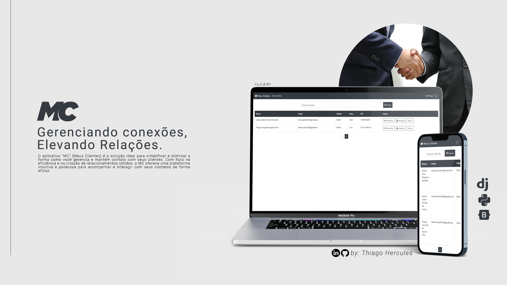
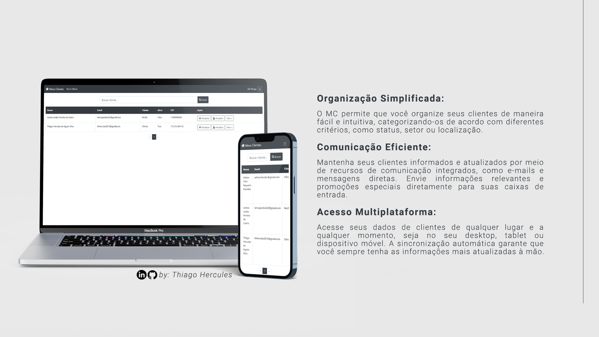

<h1>Meus Clientes - DJANGO, PYTHON, MYSQL</h1>

  
<h2>Fullstack Django - Vaga Lins Ferrao - Desenvolvedor Júnior</h2>
O MC (Meus Clientes) foi desenvolvido com expertise utilizando Django, Python e Bootstrap, criando uma sinergia perfeita entre robustez, 
agilidade e design responsivo. A aplicação foi construída com a poderosa estrutura do Django, enquanto Python adicionou a funcionalidade e a 
lógica por trás das interações. O design moderno e intuitivo foi alcançado através do Bootstrap, garantindo uma experiência de usuário fluida em diferentes dispositivos. 
O projeto MC é o resultado da harmonização perfeita entre tecnologias líderes e abordagens inovadoras para criar uma plataforma de gerenciamento de clientes eficaz e amigável.   

### IDE
- Visual Studio Code

### Tecnologias utilizadas
- Python 3.1.1
- Django 4.2.4
- Bootstrap 4
- MySQL

### Ferramentas utilizadas
- Photoshop
- Figma

### Prototipagem de telas (wireframe) e telas de funcionamento - Figma
[Clique aqui para ir a prototipagem](https://www.figma.com/file/x6HBF8nDFs8Z5uEJbrK7RV/Prints-de-Funcionamento?type=design&node-id=0%3A1&mode=design&t=URZ3lyd2kchST3yH-1) 

### Vídeo explicativo sobre a api + manual de instalação em vídeo
[Clique aqui para ir até o vídeo](https://www.youtube.com/watch?v=_nm_E_LZkeY) 

### Ideia e solução
O conceito do meu projeto nasceu como resposta a um desafio apresentado pela Lins Ferrão para a vaga de desenvolvedor. A tarefa era criar uma API de cadastro de clientes, e para otimizar meu tempo, 
criei o backend em Python. Utilizando o Bootstrap, prototipei a estrutura da web com templates pré-configurados, permitindo uma abordagem ágil. Ao longo do desenvolvimento, dediquei esforços em 
aprimorar o design da página, elevando a experiência do usuário a um novo patamar. O projeto é o resultado da união entre praticidade e criatividade, entregando uma solução eficaz e visualmente atraente.

  

### Melhorias futuras
- Refatorar o código e implementar metodologia SOLID
- Aplicar .env para dados voláteis
- Criar um website web para melhorar o consumo do produto

### Sobre a resolução do desafio
O desafio proposto de desenvolver um sistema de controle de clientes foi completamente atendido, abrangendo todos os requisitos solicitados de maneira eficaz e funcional. 
O sistema desenvolvido armazena de maneira precisa os dados essenciais de cada cliente, 
incluindo informações pessoais como nome completo, CPF, telefone, e-mail, sexo, status de ativação e endereço. 
Além disso, os dados do endereço também são armazenados com detalhes como CEP, estado, cidade, bairro, logradouro e número.

O sistema permite realizar todas as ações requeridas de forma intuitiva e eficiente:

- Cadastro de Clientes e Endereços: Os usuários podem cadastrar novos clientes, preenchendo todas as informações necessárias, inclusive o endereço associado. Isso garante que os dados do cliente e seu endereço sejam registrados de maneira coesa.

- Atualização de Dados: Os dados de clientes e endereços podem ser atualizados conforme necessário. Os usuários têm a capacidade de fazer ajustes em qualquer campo, garantindo que as informações estejam sempre atualizadas.

- Consulta de Clientes: O sistema oferece diversas maneiras de consultar clientes. É possível buscar clientes pelo seu código único, facilitando a localização precisa, ou usando filtros como CPF ou nome para encontrar rapidamente o cliente desejado. A consulta também recupera todas as informações do cliente, bem como todos os endereços associados.

O sistema demonstra um excelente controle de dados e gerenciamento, assegurando que todas as informações necessárias sejam armazenadas e recuperadas de maneira eficiente. Cada campo solicitado no desafio foi devidamente implementado, cumprindo assim todos os requisitos estabelecidos. A aplicação apresenta uma solução completa e funcional para o desafio proposto, fornecendo uma ferramenta robusta para gerenciar os dados de clientes e seus endereços de maneira eficaz.

## 🚀 Instalando e utilizando a aplicação

## Pré-requisitos

- **Python**: Certifique-se de ter o Python instalado em seu sistema. Você pode baixar a versão mais recente em [python.org](https://www.python.org/downloads/).
- **Visual Studio Code (VSCode)**: É altamente recomendado usar o Visual Studio Code como ambiente de desenvolvimento. Você pode baixá-lo em [code.visualstudio.com](https://code.visualstudio.com/).
- **MySQL**: Instale o MySQL em sua máquina. Você pode baixá-lo em [dev.mysql.com](https://dev.mysql.com/downloads/).

## Instalação e Execução

1. Abra o terminal ou o prompt de comando como administrador.

2. Instale o Django com o seguinte comando:
`pip install django`

3. Configure a variável de ambiente do Django no Windows (apenas no Windows). Adicione o caminho da pasta Scripts do Python (onde o pip está localizado) ao seu Path.

4. Instale a extensão "ms-python.python" no Visual Studio Code.

5. Instale e configure o MySQL seguindo as instruções fornecidas no site oficial.

6. Execute os seguintes comandos no terminal MySQL para criar o banco de dados:
`CREATE DATABASE linsferrao;`
`USE linsferrao;`

7. Abra o arquivo `gestaoclientes/settings.py` dentro do diretório do projeto e perceba que existem variáveis para uma chamada mais segura dos dados voláteis como senhas e afins, para preenche-las você deve ir até o arquivo `env_template.txt` presente no repositório do projeto renomea-lo para `.env`, seguir o passo a passo para configurar todas as chaves com seus dados do banco, portas de acesso do mesmo e afins, lembre-se, se isso não for feito, você não conseguirá fazer a migração. 

8. Execute o seguinte comando para criar as tabelas do banco de dados:
`python manage.py migrate`

9. Instale as dependências do projeto com os seguintes comandos:  
`pip install mysqlclient`  
`pip install python-decouple`  
`pip install django-bootstrap4`  
`pip install python-dotenv`  

11. Finalmente, execute o servidor de desenvolvimento com o seguinte comando:
 `python manage.py runserver`

12. Acesse a aplicação em seu navegador em [http://localhost:8000/](http://localhost:8000/).

### 📫 Deseja contribuir para o projeto?
Para contribuir com o projeto, siga estas etapas:

1. Bifurque este repositório.
2. Crie um branch: `git checkout -b <master>`.
3. Faça suas alterações e confirme-as: `git commit -m '<mensagem_commit>'`
4. Envie para o branch original: `git push origin <api-django-crud> / <local>`
5. Crie a solicitação de pull.

Como alternativa, consulte a documentação do GitHub em [como criar uma solicitação pull](https://help.github.com/en/github/collaborating-with-issues-and-pull-requests/creating-a-pull-request).

### 📝 Licença

Esse projeto está sob licença. Veja o arquivo [LICENÇA](LICENSE.md) para mais detalhes.

[⬆ Voltar ao topo](#api-spring-mongodb-calcme) 

